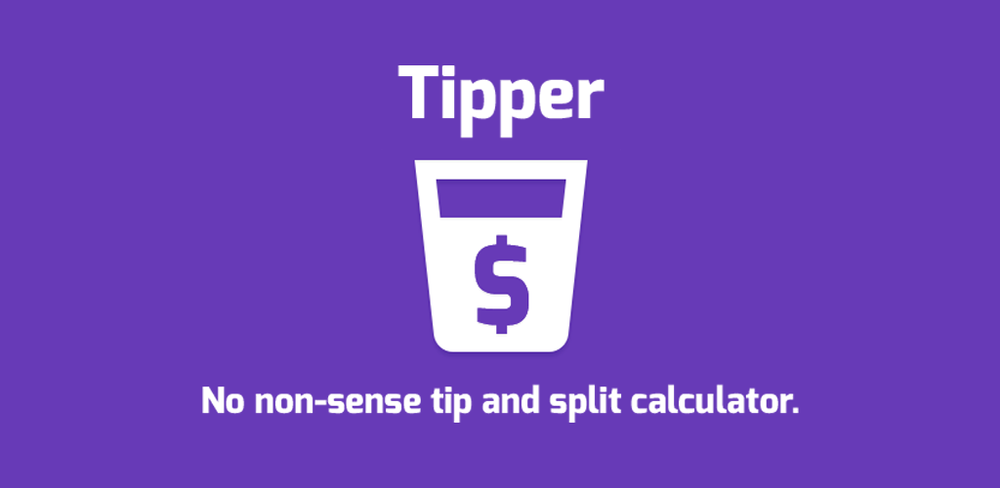

# 

Tipper is a simple tip and split calculator.

# Motivation
Provide a lightweight, no-nonsense way of calculating tips and share of bills.

# Implementation
Tipper is implemented in Xamarin.Android in C#, and XML.

# Screenshots
 

# Download
Available to download here: https://play.google.com/store/apps/details?id=co.mcgurk.tipper

# License
Copyright 2016 Paul McGurk.

This project can not be copied and/or distributed without the express permission of the authors.
